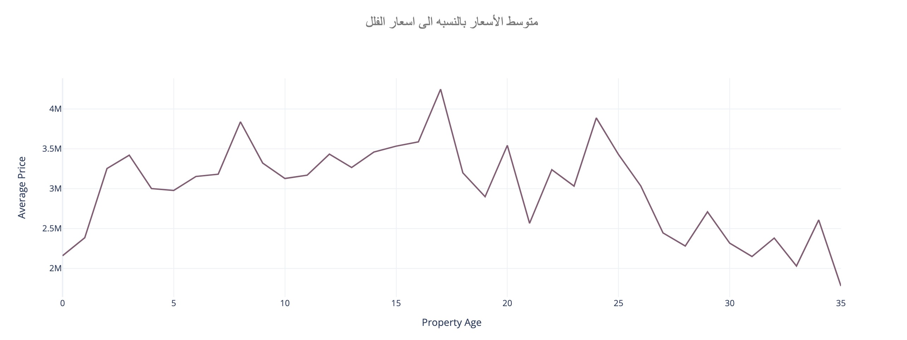
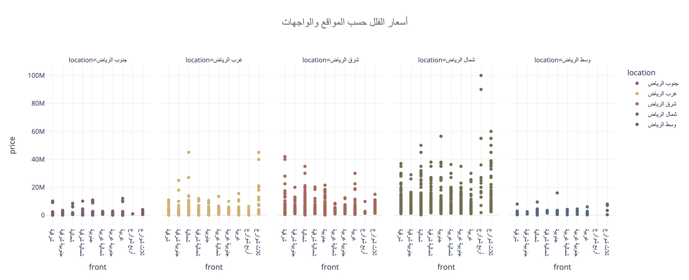
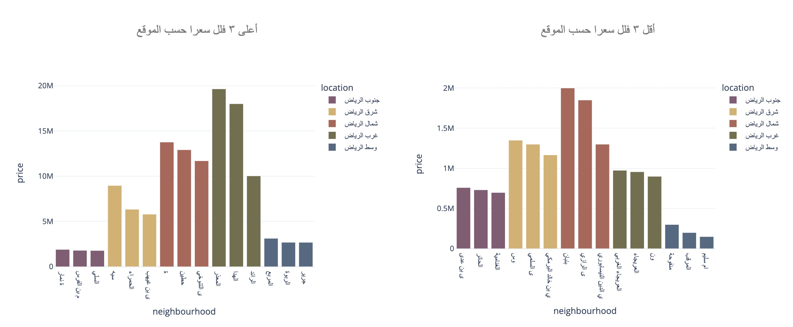
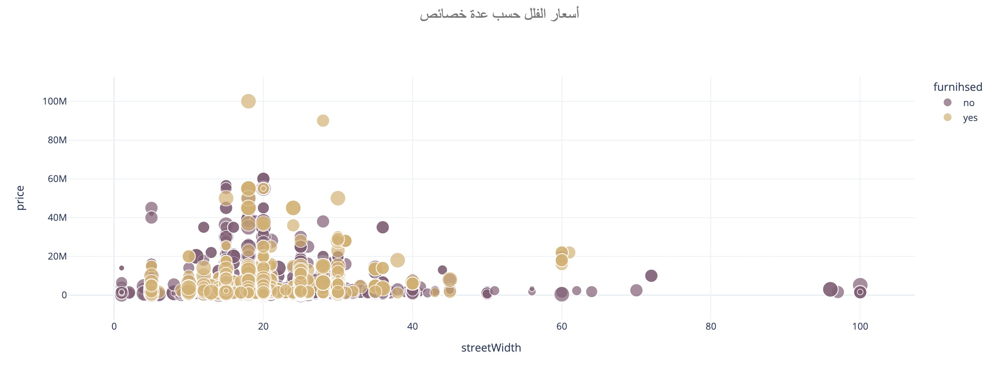
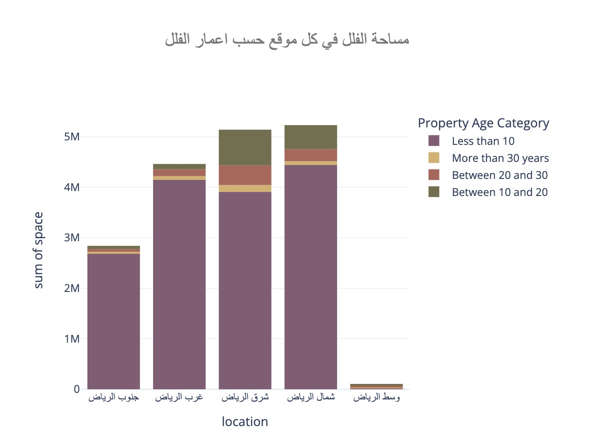
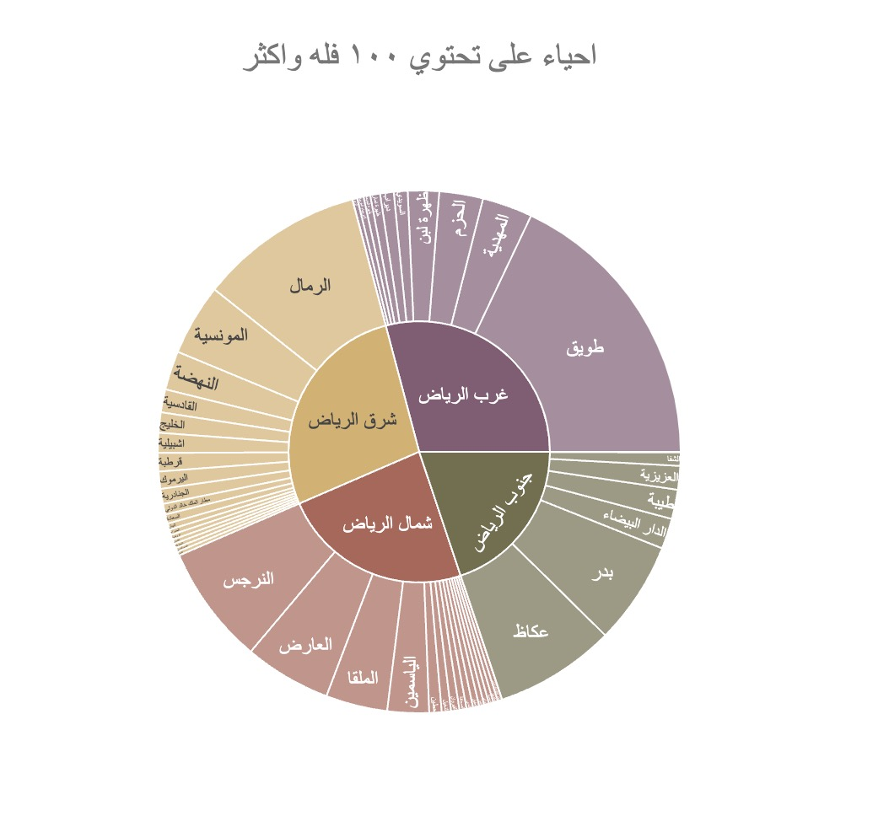
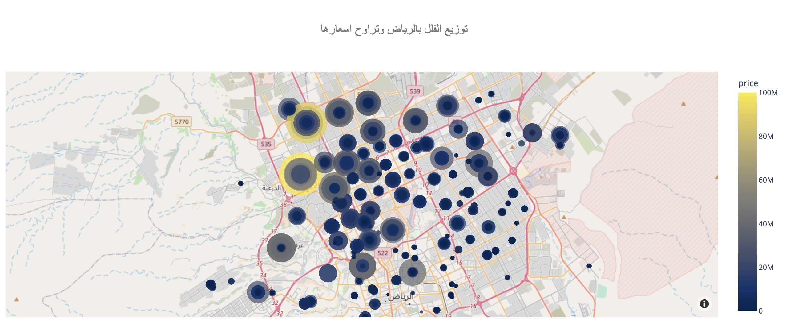

## Team Members
| Abdullah | Arwa  | Hussain | Razan
|-|-|-|-|
|Extracting insights based on EDA|Extracting insights based on EDA|Extracting insights based on EDA| Extracting insights based on EDA
| Source code management| Source code management| Source code management| Set up the interactive map|
|Readme file   | Data cleaning | Data cleaning| Data cleaning 
 || Dashboard | Readme file | Dashboard
 |||Set up hover from the map | 

# Introduction 
Most of companies headquarters are located in Riyadh and one obvious issue would be acommodation. Provided with this dataset we decided to ask common questions asked by house seekers and answer them using data analysis techniques. 
### **Problems**
- Responses were 1 for yes and 0 for no
- column names missspelled {furnished, neighbourhood}
- price and square price had 2 null values 
- street width had over 1000 values missing 
- 
### **Objectives**
- In street width nulls were replaced with the mean street width
- Change responses from 0 and 1 to yes and no 
- Choose meaningful and realistic questions and answer them using data analysis 
- Build an interactive dashboard using plotly from graphs we generated 

# **Dataset overview**
1. front: Categorical variable of where the house is facing 
2. rooms: Number of rooms in each house
3. lounges: Number of lounges in each property (categorical).
4. bathrooms: Number of bathrooms in each property (categorical).
5. streetWidth: Width of the street in front of each property (float).
6. stairs: Type of stairs in the property (categorical).
7. propertyAge: Age of the property in years (integer).
8. driverRoom: Presence of a driver's room (categorical).
9. tent: Presence of a tent (categorical).
10. patio: Presence of a patio (categorical).
11. kitchen: Type of kitchen (categorical).
12. outdoorRoom: Presence of an outdoor room (categorical).
13. garage: Presence of a garage (categorical).
14. duplex: Property type (categorical).
15. space: Area/space of the property (integer).
16. apartments: Number of apartments in the property (categorical).
17. maidRoom: Presence of a maid's room (categorical).
18. elevator: Presence of an elevator (float).
19. furnihsed: Property furnishing status (categorical).
20. pool: Presence of a pool (categorical).
21. basement: Presence of a basement (categorical).
22. neighbourhood: Neighborhood of the property (categorical).
23. location: Location details (categorical).
24. price: Price of the property (float).
25. square price: Price per square unit (float).

#### **Data Source**
- https://www.kaggle.com/datasets/reemamuhammed/riyadh-villas-aqar

# Insights

  

-  The houses are modern to the age of 5 years, and their prices range from approximately 2 million,houses within the age range of up to 5 years are considered modern, with prices averaging around 2 million.

  

 
- There are no houses that have a front on 4 streets in mid Riyadh 

  

-  the lowest average price across all neighborhoods and locations is ام سليم في وسط الرياض  

 

 - The most expensive house offered is for 100M, the good news is that it comes with furniture 

 

 - Most available buildings were built within 10 years while most older buildings are located in east Riyadh
 
  

 - The most centrally located within it. For instance, Tuwaiq is situated to the west of Riyadh, whereas the least centrally located neighborhood is Al-Nadwa, which is positioned in the eastern part of Riyadh

  

 - These two neighborhoods, Al-Malqa and Hattin, situated in the northern part of Riyadh, are known as the most expensive areas in the city. This signifies that the highest property prices can be found within them. On the other hand, the least expensive neighborhoods, Al-Yama and Ateeqa, are located in eastern Riyadh, highlighting that house prices in this region are the lowest across the city.